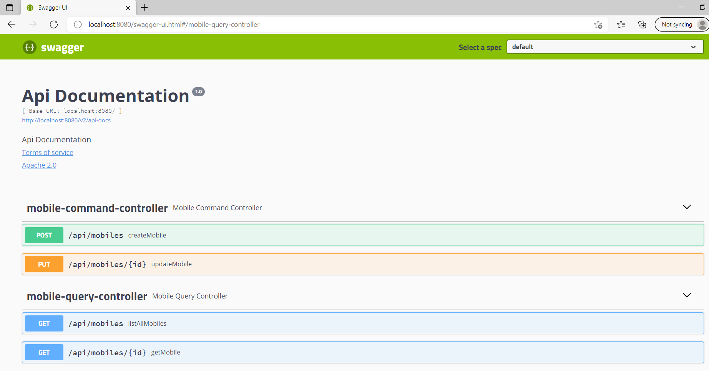
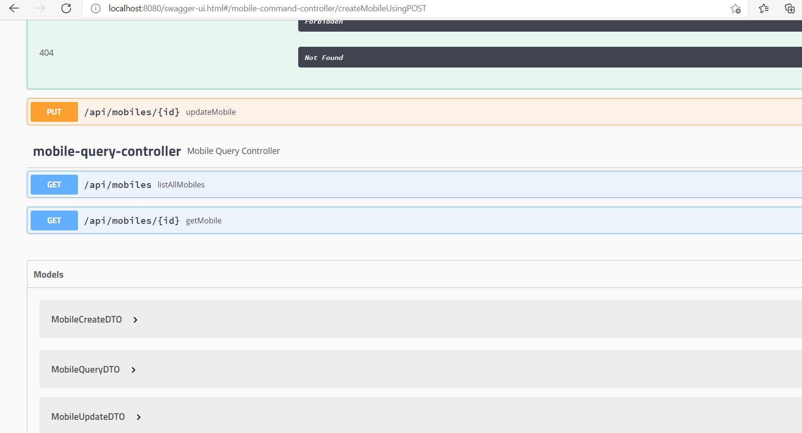
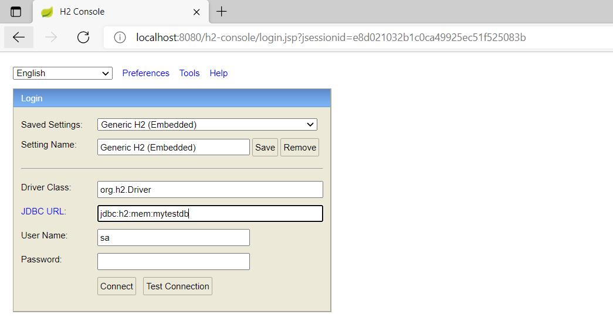
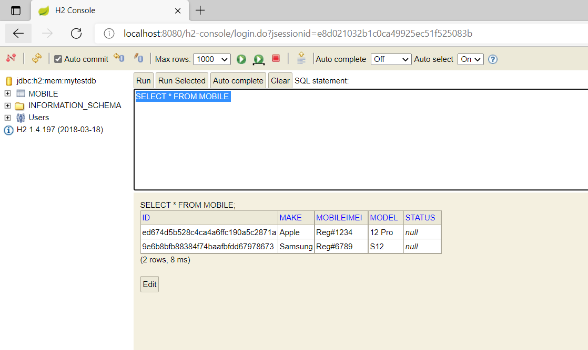

# spring-boot-swagger-h2-demo
A Simple spring boot app service example using Swagger API and H2.

## Swagger:

URL: `http://localhost:8080/swagger-ui.html`

Screen 1:

Screen 2:

## H2 Console:

URL: `http://localhost:8080/h2-console`

Screen 1: 

Screen 2: 

## Libraries used
- Spring Boot
- Spring Configuration
- Spring REST Controller
- Spring JPA
- H2
- Development Tools

## Compilation Command
- `mvn clean install` - Plain maven clean and install